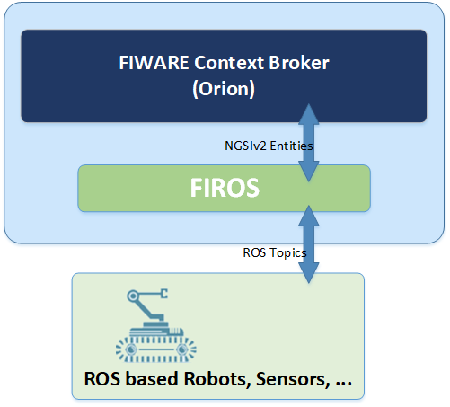

# FIROS

<!---->

  
<!--
-->

FIROS works as a translator between the robotics field and the cloud world, transforming ROS messages into NGSI v2 to
publish them in the cloud, and vice versa. The following figure depicts the integration of FIROS inside the FIWARE
platform.

FIROS is a tool that helps connecting robots to the cloud. For this purpose it uses the
[Robot Operating System (ROS)](http://www.ros.org/) and the
[FIWARE Context Broker](http://catalogue.fiware.org/enablers/publishsubscribe-context-broker-orion-context-broker) as a
way to publish and listen robot's data.

FIROS works as a translator between the robotics field and the cloud world, transforming ROS messages into NGSI to
publish them in the cloud, and vice versa.

This project is a fork from the **outdated** [Ikergunes FIROS package](https://github.com/Ikergune/firos).

This project is part of [FIWARE](https://www.fiware.org/). For more information check the FIWARE Catalogue entry for the
[Robotics](https://github.com/Fiware/catalogue/tree/master/robotics).

| :books: [Documentation](https://firos.rtfd.io) | :dart: [Roadmap](doc/roadmap.md) |
| ---------------------------------------------- | -------------------------------- |

## Contents

-   [Install](#Install)
-   [Usage](#usage)
-   [Troubleshooting](#troubleshooting)
-   [License](#license)
-   [Contributors](#Contributors)
-   [Additional Resources](#Additional%20Resources)

## Install

Refer to the Installation-Guide [here](doc/install/install.md)

## Usage

Refer to the User-Guide [here](doc/user/introduction.md)

## Troubleshooting

TBD

## License

FIROS is licensed under [MIT License](https://opensource.org/licenses/MIT).

## Contributors

Dominik Lux, Peter Detzner

## Additional Resources

### Presentations

FIROS-Helping Robots to be Context Aware
([Slideshare](https://de.slideshare.net/FI-WARE/fiware-global-summit-FIROS-helping-robots-to-be-context-aware),
28.11.2018 FIWARE Global Summit, Malaga)
